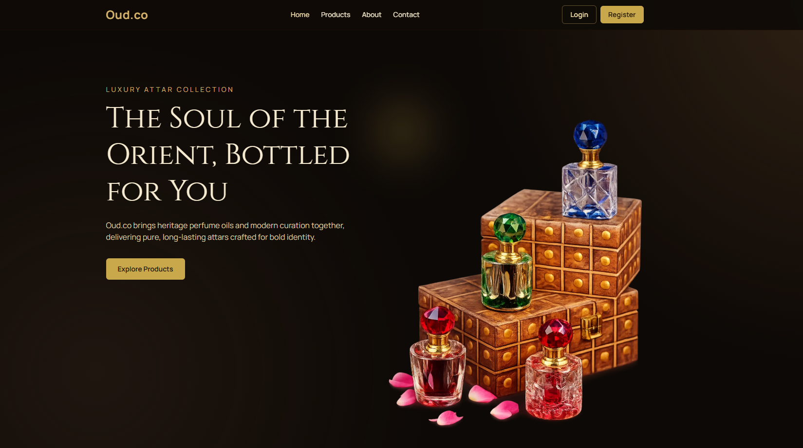

# Oud.co

<div align="center">
  
</div>

Premium perfume oil and attar e-commerce application built with Next.js App Router, React, TypeScript, Tailwind CSS v4, and Firebase Authentication.

## Project Summary

Oud.co is a modern storefront experience for browsing, searching, filtering, and managing perfume products.

Core capabilities:

- Public product browsing and product details.
- Firebase authentication (Email/Password + Google).
- Protected product management routes.
- Local-first product persistence using browser localStorage.
- Responsive UI for desktop and mobile.

## Tech Stack

- Framework: Next.js 16.2.4 (App Router)
- Runtime/UI: React 19.2.4 + React DOM 19.2.4
- Language: TypeScript 5
- Styling: Tailwind CSS 4 + PostCSS
- Auth: Firebase Web SDK 12
- Icons: lucide-react, react-icons
- Linting: ESLint 9 + eslint-config-next

## Runtime Requirements

- Node.js >= 20.0.0 (defined in package engines)
- npm (project uses package-lock.json)

## Main Features

### Public Experience

- Home page with:
  - Hero section
  - Featured products
  - Why choose us section
  - Testimonials
  - Promotional CTA banner
- Products page:
  - Real-time text search by title
  - Category filter
  - Price range filter
- Product details page:
  - Full description and specifications
  - Related products from same category
- About page and Contact page

### Authentication

- Register with name, email, and password.
- Login with email/password.
- Google sign-in support.
- Session state persisted via Firebase auth listener.

### Protected Product Management

- Add product route (protected)
- Manage products route (protected)
- Edit product route (protected)
- Delete support for custom products

### Notifications and UX

- Global toast notification system.
- Confirmation modal before destructive actions.
- Responsive navbar with user dropdown + mobile menu.

## Route Map

### App Routes

- `/` Home page
- `/products` Product listing with search + filters
- `/products/[id]` Product details
- `/about` About page
- `/contact` Contact page
- `/login` Login page
- `/register` Register page

### Protected Routes

- `/products/add` Add product
- `/products/manage` Manage products
- `/products/manage/[id]` Edit product

Unauthenticated access to protected routes redirects to:

- `/login?next=<encoded-current-path>`

## Architecture and Data Flow

### Auth Layer

- `src/context/AuthContext.tsx`
  - Exposes: `user`, `loading`, `login`, `register`, `loginWithGoogle`, `logout`
  - Uses Firebase `onAuthStateChanged` for session sync

### UI Shell

- `src/app/layout.tsx`
  - Loads global fonts and styles
  - Wraps app with:
    - `AuthProvider`
    - `ToastProvider`
  - Shared layout includes `Navbar` and `Footer`

### Product Data Layer

- `src/lib/products.ts`
  - Static catalog seed (`staticProducts`)
  - Custom products in localStorage
  - Override support for editing static products
  - Image source normalization and validation

Storage keys used:

- `oud_co_custom_products_v1`
- `oud_co_product_overrides_v1`

### Product Types

- `src/types/product.ts`
  - `ProductCategory`
  - `Product`
  - `NewProductInput`

## Project Structure

```text
.
|- public/
|- src/
|  |- app/
|  |  |- about/page.tsx
|  |  |- contact/page.tsx
|  |  |- login/page.tsx
|  |  |- register/page.tsx
|  |  |- products/
|  |  |  |- page.tsx
|  |  |  |- [id]/page.tsx
|  |  |  |- add/page.tsx
|  |  |  |- manage/page.tsx
|  |  |  |- manage/[id]/page.tsx
|  |  |- globals.css
|  |  |- layout.tsx
|  |  |- page.tsx
|  |- components/
|  |  |- ConfirmModal.tsx
|  |  |- Footer.tsx
|  |  |- Navbar.tsx
|  |  |- ProductCard.tsx
|  |  |- ProductForm.tsx
|  |  |- ProtectedRoute.tsx
|  |- context/
|  |  |- AuthContext.tsx
|  |  |- ToastContext.tsx
|  |- lib/
|  |  |- firebase.ts
|  |  |- products.ts
|  |- types/
|     |- product.ts
|- .env.local.example
|- next.config.ts
|- package.json
```

## Environment Variables

Create `.env.local` with Firebase web config:

```env
NEXT_PUBLIC_FIREBASE_API_KEY=
NEXT_PUBLIC_FIREBASE_AUTH_DOMAIN=
NEXT_PUBLIC_FIREBASE_PROJECT_ID=
NEXT_PUBLIC_FIREBASE_STORAGE_BUCKET=
NEXT_PUBLIC_FIREBASE_MESSAGING_SENDER_ID=
NEXT_PUBLIC_FIREBASE_APP_ID=
```

Firebase setup checklist:

- Create Firebase project
- Enable Authentication
- Enable Email/Password provider
- Enable Google provider
- Add your app domain to authorized domains

## Getting Started

1. Install dependencies:

```bash
npm install
```

2. Configure environment variables in `.env.local`.

3. Run development server:

```bash
npm run dev
```

4. Open:

```text
http://localhost:3000
```

## Available Scripts

- `npm run dev` Start local dev server
- `npm run build` Create production build
- `npm run start` Start production server
- `npm run lint` Run ESLint
- `npm run deploy:check` Run lint + build before deployment

## Image Configuration

Remote image loading is configured in `next.config.ts` for:

- `images.unsplash.com`

If additional external image hosts are required, add them to `images.remotePatterns`.

## Product Management Behavior

- Static products are seeded in code.
- New products are created as `custom-<timestamp>` IDs and stored in localStorage.
- Editing static products creates local overrides.
- Deleting static products removes override data only.
- Deleting custom products removes actual custom entries.

## Deployment Notes

- Vercel configuration file exists: `vercel.json`
- Recommended pre-deploy check:

```bash
npm run deploy:check
```

## Known Constraints

- Product persistence is browser-local (localStorage), not shared across users/devices.
- Uploaded product images are saved as Data URLs in localStorage and can increase storage usage.
- Contact form currently simulates submission and does not call a backend API.

## Maintenance Suggestions

- Replace localStorage product persistence with a database/API for multi-user support.
- Add role-based authorization for admin-only product management.
- Add automated tests (unit/integration/e2e).
- Add CI workflow for lint/build checks on pull requests.

## License

Copyright (c) 2026 Oud.co. All rights reserved.
